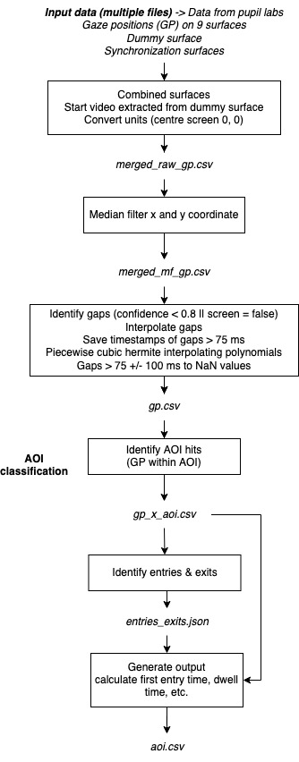

# Dynamic AOI Toolkit

This toolkit includes tools to measure dynamic areas of interest (AOI) on a widescreen based on the Pupil Labs Core eye tracker data. The tools included are: (1) AOI selector (both automatic and manual), (2) overlay AOIs and gaze on the task presented and (3) AOI hit detection.

## Table of Contents

> TODO: (joris) links maken van TOC

1. Installation
1. Usage
   1. Data structure
   1. AOI Selector
      1. Method 1: Tracking objects semi-automatically
      1. Method 2: Selection AOI
      1. Combining the AOI Selector output
   1. AOI Overlay
      1. Overlaying AOIS and gaze positions over a video
      1. Overlaying AOIS over a video
   1. AOI Hit detection
1. Contribution
1. License

## Installation

To use the toolkit, make sure python3 is installed. To install the latest version of this toolkit, use:

```bash
git clone git@github.com:treyescan/dynamic-aoi-toolkit.git

pip3 install -m requirements.txt
```

After this, open `__constants.py` and change the variable `data_folder` to point to the data folder as structured below.

## Usage

### 1. Data structure (data folder)

> TODO: (joris) even opschonen en visueel aantrekkelijker maken
> TODO: (yasmin) alles goed opschrijven

- data/

  - input-aoi/
    - task1_aois.csv
    - ... (more aois)
  - input-gp/
    - [example-participant](/data/input-gp/example-participant/README.md)
    - P-001/
      - task1/
        - n surfaces from Pupil Labs
        - dummy surface from Pupil Labs
        - synchronization surface from Pupil Labs
        - gp.csv (generated by tools/analysis)
      - ... (more tasks)
    - ... (more participants)
  - output/
    - P-001/
      - task1/
        - number_of_filtered_rows.txt TODO
        - gp_x_aoi.csv
        - entries_exits.json
        - outputfile.csv    
      - ... (more task)
    - ... (more participants)
  - videos/
    - start_end_frames/
      - synchronization/
        - task1.json (this file contains start and end frame numbers of all synchronization surfaces)
        - (more tasks)
    - task1.mp4
    - ... (more videos)

### 2. AOI Selector

The AOI Selector allow the user to define dynamic AOIs. This can be done semi-automatically or manually. Both methods can be used intertwined, after which the data files can be combined. We can check the data files by overlaying the csv files over a video in the AOI overlay tool.

#### Method 1: Tracking objects semi-automatically

```bash
python3 aoi_tracking.py --video="video.mp4" --start_frame=70
```

**Usage:**

1. Run the command above, replacing `vid.mp4` with the path to your video
1. The video will open a preview screen
1. If you want to select an object to track from the first frame, draw a box on the video
1. If not: hint `[enter]` to play the video, hit `[s]` when you want to select an object
1. The video starts playing and shows the tracked object. In this state, the results are directly saved to your output csv
1. When you're done, stop the script by hitting `[q]`

#### Method 2: Selection AOI

```bash
# use this to select  frames and let the script interpolate the frames in between
python3 aoi_selection.py --video="video.mp4" --start_frame=100

# use this to select each frame manually
python3 aoi_selection.py --video="video.mp4" --start_frame=100 --manual
```

**Usage:**

1. Run the command above, replacing `videos/vid.mp4` with the path to your video
1. The video will open a preview screen
1. If you want to select a AOI from the first frame
1. If not: hint `[enter]` to play the video, hit `[s]` when you want to select a AOI
1. The video starts playing **without** showing the AOI. when you want to select a new AOI, hit `[s]`
1. When you're done, stop the script by hitting `[q]`
1. The script will print the selected bounding boxes to the console and calculate the coordinates of the AOI in between
1. The script will show you the computed AOI's by showing the video again and save it to the output file.

#### Combining the AOI Selector output

```bash
python3 concat_files.py --folder data/testvideo
```

1. Make sure all output files from script 1 and 2 are saved in one folder
1. Run the command above, replacing data/testvideo` with the path to your output folder
1. The files will be concatenated to a single file (`combined_data/dataset.csv`). The console will show you the path of this file

### 3. AOI Overlay

In AOI overlay, 3 tools are presented in order to display selected AOIs and gaze positions. The scripts overlay each frame of the task with information, depending on the chosen tool. Options include: only AOIs, AOIs + gaze of one participant and AOIs + gaze data of all available participants.

#### Overlaying AOIS over a video

```bash
cd tools/overlay/
python3 overlay_only_aois.py --video="video.mp4" --aois="aois.csv" --start_frame=1000
```

**Usage**

- Run the command above
- The video will be outputted to `video_with_labels.mp4` in the same folder
- Make sure to move this video before creating a new video
- NB: video processing make take a while since every frame has to be processed at full resolution

#### Overlaying AOIs and gaze positions over a video

```bash
# for one participant
cd tools/overlay/
python3 overlay_single_participant.py --video="video.mp4" --aois="aois.csv" --participant="{folder to particpant}" --start_frame=800
```

**Usage:**

> TODO:

```bash
# for multiple participants
cd tools/overlay/
python3 tools/overlay_multiple_participants.py --video="video.mp4" --aois="aois.csv" --task="{folder of participants}" --start_frame=800
```

**Usage:**

> TODO:

1. all gp.csv in {folder of participants} are fetched (last one)
1. output: video_with_multiple_gp.mp4

### 4. AOI Hit detection



AOI hit detection provides a tool to calculate measures such as dwell time and time to first entry. For every gaze position, the corresponding frame is checked for an AOI hit within the AOIs as defined by the AOI selectors.

1. Put the data in the appropiate data folder (see Data structure)
1. Make sure all other files are in place:
   1. data/videos/synchronization/task.json

```bash
cd hit-detection
python3 analyse.py # this script will ask for all input and display where the output files are saved
```

**Usage**

> 1. TODO:

## 3. Contribution

[Issues](https://github.com/treyescan/dynamic-aoi-toolkit/issues/new) and other contributions are welcome.

## 4. License

This toolkit is licsensed under [GNU GENERAL PUBLIC LICENSE V3](/LICENSE)
